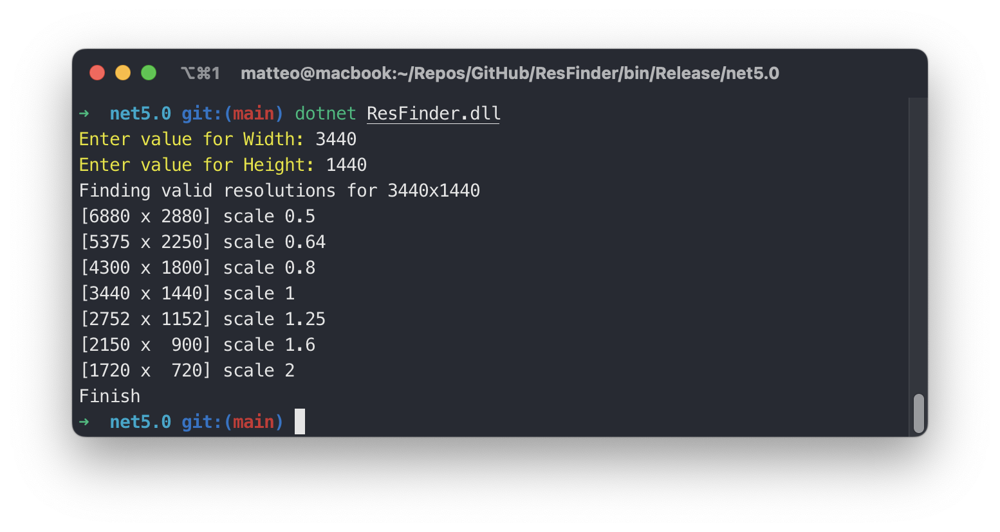

# ResFinder

Find best scaled resolution for a specific monitor. This is useful when you need a custom resolution for your mac that match perfectly your pixel resolution.

## Open the project
Open `ResFinder.sln` using Visual Studio.

## Build
Run the script `build.sh`
```
./build.sh
```

## Usages

Run the script `run.sh`
```
./run.sh
```

## Screenshot

